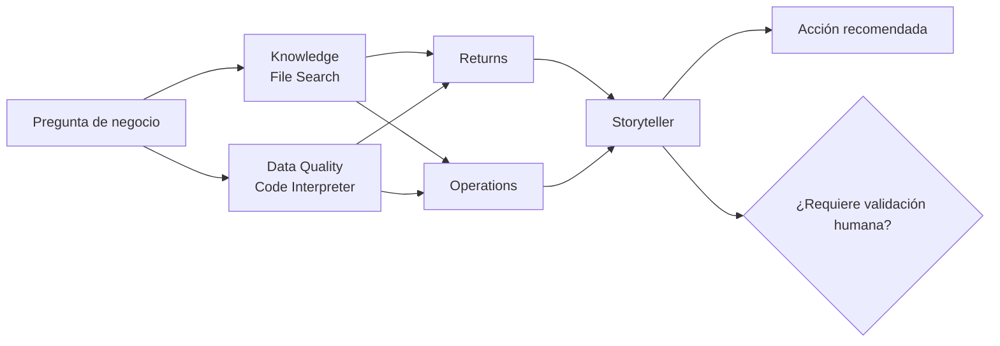

# 🖱️ Paso a paso: demo con interfaz gráfica de Microsoft Foundry

Esta guía está pensada para ejecutar la sesión sin escribir código, usando el portal de Microsoft Foundry: Agent Designer, herramientas, Playground, Workflow Designer y trazas.

## 🎯 Objetivo

Construir una demo visual donde el público vea:

1. un agente que responde con políticas internas,
2. un agente que analiza CSVs con Python gestionado,
3. un workflow multiagente que coordina especialistas,
4. una respuesta final con evidencia, riesgos y acción recomendada.

## 🧾 Material necesario

Archivos del caso:

- `case/fraso_home_caso.md`
- `case/fraso_home_storytelling_foundry.md`
- `case/kb/README.md`
- `case/kb/FS-KB-*.md`
- `case/data/*.csv`

Recursos Foundry:

- proyecto de Microsoft Foundry,
- modelo desplegado,
- permisos para crear agentes,
- permisos para cargar archivos y usar herramientas,
- acceso a Playground,
- trazas u observabilidad si se van a enseñar.

## 🧭 Mapa de la demo



## 1. Abrir Microsoft Foundry 🚪

1. Entra en [Microsoft Foundry](https://ai.azure.com).
2. Selecciona el proyecto de la sesión.
3. Comprueba que hay un modelo desplegado.
4. Abre la sección de agentes.
5. Verifica que puedes crear agentes y abrir Playground.

Mensaje para explicar:

> “Foundry nos da un lugar común para diseñar, probar, observar y operar agentes, sin empezar directamente por código.”

## 2. Crear `frasohome-knowledge` 🧠

### Configuración

1. Crea un prompt agent.
2. Nombre: `frasohome-knowledge`.
3. Modelo: el deployment de la sesión.
4. Herramienta: **File Search**.

### Archivos a subir

Sube al vector store:

- `case/fraso_home_caso.md`
- `case/fraso_home_storytelling_foundry.md`
- `case/kb/README.md`
- todos los `case/kb/FS-KB-*.md`

### Instrucciones

```text
Eres el agente Knowledge de FraSoHome.

Responde preguntas operativas usando solo los documentos conectados.

Prioridad documental:
1. Políticas y guías vigentes de la KB.
2. FAQ interna de operaciones y atención.
3. Documento narrativo del caso.
4. Storytelling de la presentación.

Reglas:
- No inventes políticas, excepciones ni métricas.
- Si falta una política formal o hay conflicto entre documentos, dilo.
- Responde con pasos breves y accionables.
- Incluye evidencia documental.
- Incluye incertidumbres y siguiente acción.
```

### Prueba

```text
Un cliente compró un sofá online, quiere devolverlo en tienda y usó un cupón. ¿Qué pasos debe seguir atención al cliente?
```

Qué enseñar:

- respuesta grounded,
- referencias a política/FAQ,
- incertidumbres,
- siguiente acción operativa.

## 3. Crear `frasohome-data-quality` 📊

### Configuración

1. Crea un prompt agent.
2. Nombre: `frasohome-data-quality`.
3. Herramienta: **Code Interpreter**.
4. Adjunta los CSV de `case/data`.

### Instrucciones

```text
Eres el agente Data Quality de FraSoHome.

Usa Python para leer y perfilar los CSV adjuntos.
No inventes cifras. Toda métrica debe salir de un cálculo.

Genera un Data Quality Report con:
- filas y columnas por archivo
- nulos críticos
- duplicados
- claves sin correspondencia si pueden verificarse
- fechas fuera de rango
- importes, cantidades o stock anómalos
- cinco acciones de limpieza priorizadas

Usa la KB como referencia para interpretar KPIs, devoluciones, SKUs, fidelización y pagos.
```

### Prueba

```text
Analiza los CSV de FraSoHome. Genera un Data Quality Report con tabla resumen y cinco acciones de limpieza priorizadas antes de crear features o dashboards.
```

Qué enseñar:

- Code Interpreter ejecutando Python,
- tabla por archivo,
- duplicados reales,
- recomendaciones basadas en cálculo.

## 4. Crear especialistas del workflow 🧩

### `frasohome-returns`

Responsabilidad: devoluciones online y tienda.

```text
Eres el agente Returns de FraSoHome.

Usa la política de devoluciones vigente, la FAQ interna y el manual de tienda cuando aplique.
Interpreta motivos, canales, categorías, tasas e impacto.

Devuelve JSON:
{
  "agent": "returns",
  "hallazgos": [],
  "evidencias": [],
  "riesgos": [],
  "confianza": 0.0
}
```

### `frasohome-operations`

Responsabilidad: operación, stock, pagos, tienda, conciliación y catálogo.

```text
Eres el agente Operations de FraSoHome.

Analiza causas operativas relacionadas con stock, tiendas, pedidos, logística, disponibilidad, pagos, conciliación ecommerce, taxonomía SKU y canal.

Devuelve JSON:
{
  "agent": "operations",
  "hallazgos": [],
  "evidencias": [],
  "riesgos": [],
  "confianza": 0.0
}
```

### `frasohome-storyteller`

Responsabilidad: síntesis ejecutiva.

```text
Eres el agente Storyteller de FraSoHome.

Convierte evidencias de especialistas en una recomendación ejecutiva clara.
No añadas cifras nuevas. No ocultes incertidumbres.

Devuelve JSON válido con:
- pregunta
- causa_probable
- evidencias
- riesgos
- accion_7_dias
- metrica_seguimiento
- requiere_validacion_humana
```

## 5. Crear workflow `frasohome-orchestrator` 🧭

1. Crea un workflow agent.
2. Nombre: `frasohome-orchestrator`.
3. Añade nodo de entrada con la pregunta del usuario.
4. Añade nodo Router.
5. Conecta:
   - Knowledge,
   - Data Quality,
   - Returns,
   - Operations,
   - Storyteller.
6. Añade condición de validación humana.

### Prompt de prueba

```text
¿Por qué están subiendo las devoluciones online en iluminación y qué haríamos esta semana?
```

### Condición

```text
Si storyteller.output.requiere_validacion_humana == true
```

Rama “sí”:

```text
La recomendación requiere validación humana antes de ejecutarse.
```

Rama “no”:

```text
Entregar respuesta final.
```

## 6. Mostrar trazas y tool calls 🔍

Durante la demo, muestra:

- conversación en Playground,
- llamadas a File Search,
- ejecución de Code Interpreter,
- pasos del workflow,
- latencia/coste si está disponible,
- punto de validación humana.

Mensaje clave:

> “No basta con que el agente responda: necesitamos ver qué documentos leyó, qué herramientas ejecutó y qué parte requiere validación.”

## ✅ Checklist de sesión

- [ ] Proyecto Foundry abierto.
- [ ] Modelo desplegado seleccionado.
- [ ] `frasohome-knowledge` creado con File Search.
- [ ] KB cargada en vector store.
- [ ] `frasohome-data-quality` creado con Code Interpreter.
- [ ] CSVs cargados.
- [ ] Especialistas creados.
- [ ] Workflow creado.
- [ ] Prompts canónicos probados.
- [ ] Trazas o historial listos para enseñar.
- [ ] Validación humana visible.

## 📚 Referencias internas

- [agents.md](agents.md)
- [case/paso_a_paso_portal_foundry_agents_workflows.md](case/paso_a_paso_portal_foundry_agents_workflows.md)
- [case/plan_sesion_practica_foundry_frasohome.md](case/plan_sesion_practica_foundry_frasohome.md)
