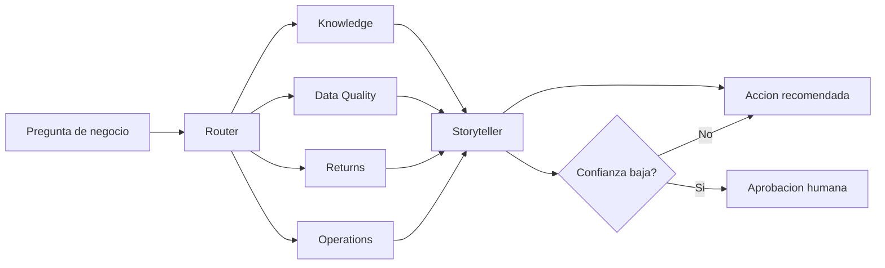

# FraSoHome Agents: Microsoft Foundry Demo Playbook

Este archivo define como construir, probar y demostrar los agentes de FraSoHome en Microsoft Foundry siguiendo buenas practicas de desarrollo, seguridad, observabilidad y evaluacion.

## Objetivo operativo

Ejecutar el plan de sesion practica definido en `case/plan_sesion_practica_foundry_frasohome.md` mediante dos rutas complementarias:

- **Foundry Portal:** disenar y mostrar la experiencia grafica de agentes, herramientas, workflow, playground, trazas y monitorizacion.
- **SDK Python:** reproducir la demo en codigo para versionado, pruebas, automatizacion y evolucion hacia Agent Framework o hosted agents.

La demo debe producir tres resultados visibles:

- `frasohome-knowledge`: agente grounded en documentos del caso.
- `frasohome-data-quality`: agente que usa Code Interpreter para perfilar CSVs.
- `frasohome-orchestrator`: flujo multiagente que responde una pregunta ambigua con evidencias, riesgos y accion recomendada.

## Fuentes del caso

Usar estos archivos como unica fuente local de verdad:

- `case/fraso_home_caso.md`
- `case/fraso_home_storytelling_foundry.md`
- `case/plan_sesion_practica_foundry_frasohome.md`
- `case/kb/README.md`
- `case/kb/markdown/*.md`
- `case/data/*.csv`

La base de conocimiento `case/kb/markdown` contiene las politicas operativas de FraSoHome:

- `FS-KB-01_Politica_Devoluciones_v1.3_Vigente.md`: devoluciones omnicanal, plazos, excepciones, reembolsos, costes y escalado.
- `FS-KB-03_Diccionario_KPI_Reglas_Calculo_v1.0.md`: KPIs y reglas de calculo.
- `FS-KB-04_Manual_Tienda_Caja_y_Pagos_Mixtos_v2.1.md`: cierre de caja, pagos mixtos y devoluciones en tienda.
- `FS-KB-05_Guia_Conciliacion_Pagos_Ecommerce_v1.4.md`: conciliacion de pagos ecommerce y SLAs.
- `FS-KB-06_Taxonomia_Catalogo_y_Reglas_SKU_v1.2.md`: taxonomia de catalogo, categorias y reglas SKU.
- `FS-KB-07_Guia_Fidelizacion_CRM_v1.1.md`: FraSoHome Rewards, tiers, puntos, segmentacion y privacidad.
- `FS-KB-09_FAQ_Operaciones_y_Atencion_v1.0.md`: FAQ interna de operaciones y atencion.

No inventar politicas, metricas, incidencias ni valores de negocio. Para respuestas normativas, priorizar la KB vigente sobre la narrativa del caso. Si hay conflicto entre documentos, citarlo como riesgo y pedir validacion humana.

## Principios de diseno

### 1. Elegir el tipo de agente por control requerido

- Usar **Prompt agents** para prototipos rapidos, Q&A grounded, asistentes internos y tareas con herramientas sencillas.
- Usar **Workflow agents** cuando el proceso tenga pasos visibles, branching, aprobacion humana o coordinacion entre especialistas.
- Usar **Hosted agents / Agent Framework** cuando haga falta logica propia, estado avanzado, integraciones complejas, tests, CI/CD o control completo del comportamiento.

Regla de diseno: si una parte del proceso puede implementarse de forma determinista con codigo, validacion o consulta estructurada, debe exponerse como herramienta o funcion. No delegar calculos criticos al texto libre del modelo.

### 2. Separar razonamiento, herramientas y evidencia

Cada agente debe tener:

- Rol claro.
- Entradas permitidas.
- Herramientas autorizadas.
- Formato de salida esperado.
- Criterios de aceptacion.
- Limites explicitos y condiciones para pedir validacion humana.

Toda respuesta final debe indicar:

- De donde sale la informacion.
- Que calculo o fuente respalda la conclusion.
- Que incertidumbre queda abierta.
- Que accion concreta propone.

### 3. Seguridad e identidad

- Usar Microsoft Entra ID y RBAC para acceso a Foundry, Application Insights, Storage y Log Analytics.
- Evitar secretos estaticos en codigo, prompts, argumentos de herramientas o trazas.
- No incluir tokens, connection strings ni credenciales en el repositorio.
- Tratar las trazas como telemetria de produccion: aplicar controles de acceso, minimizacion de datos y politica de retencion.
- Redactar o minimizar PII antes de enviarla a trazas, evaluaciones o datasets de prueba.

### 4. Observabilidad desde el prototipo

Microsoft Foundry soporta trazas, evaluaciones y monitorizacion integradas con Application Insights. La demo debe mostrar al menos una evidencia de ejecucion:

- Historial de conversacion en Playground.
- Tool calls ejecutadas.
- Trazas de agente o workflow.
- Latencia, uso de tokens o resultado de evaluacion si esta disponible.

En desarrollo con SDK, preparar la ruta para OpenTelemetry y `azure-core-tracing-opentelemetry` cuando se quiera instrumentar codigo cliente.

### 5. Evaluacion y calidad

Antes de considerar la demo lista, validar:

- Groundedness: la respuesta Knowledge se apoya en documento.
- Tool accuracy: Data Quality usa Python/CSV para calcular metricas.
- Task completion: el flujo multiagente devuelve causa, evidencia, impacto, accion y metrica.
- Safety: el agente reconoce incertidumbre y no recomienda acciones sensibles sin validacion.
- Regression: los prompts principales se pueden repetir y comparar.

## Configuracion requerida

Variables de entorno esperadas:

```powershell
$env:PROJECT_ENDPOINT="https://<resource>.services.ai.azure.com/api/projects/<project>"
$env:MODEL_DEPLOYMENT="<model-deployment-name>"
$env:VECTOR_STORE_ID="<vector-store-id-if-created>"
```

Dependencias base:

```powershell
python -m venv .venv
.\.venv\Scripts\Activate.ps1
pip install "azure-ai-projects>=2.0.0" azure-identity python-dotenv
pip install agent-framework-azure-ai --pre
```

Autenticacion:

```powershell
az login
az account show
```

## Agentes a construir

### `frasohome-knowledge`

Proposito: responder preguntas operativas sobre FraSoHome usando documentos del caso.

Herramienta principal: File Search.

Documentos iniciales:

- `case/fraso_home_caso.md`
- `case/fraso_home_storytelling_foundry.md`
- `case/kb/README.md`
- Todos los Markdown de `case/kb/markdown/*.md`

Instrucciones:

```text
Eres el agente Knowledge de FraSoHome. Responde como asistente de operaciones para un retailer omnicanal de hogar y decoracion.

Usa solo el conocimiento proporcionado por los documentos conectados. Prioriza las politicas de `case/kb/markdown` cuando la pregunta sea normativa u operativa. Usa la narrativa del caso para contexto y la KB para reglas vigentes. Si falta una politica concreta o hay conflicto entre documentos, dilo claramente. Entrega respuestas breves, accionables y trazables.

Formato de salida:
- Respuesta
- Evidencia
- Incertidumbres
- Siguiente accion
```

Prompt de validacion:

```text
Un cliente compro un sofa online, quiere devolverlo en tienda y uso un cupon. Que pasos debe seguir atencion al cliente?
```

Criterios de aceptacion:

- Responde con pasos operativos.
- Cita o resume evidencia documental.
- Declara incertidumbre si no hay politica formal.
- No inventa excepciones de cupones o reembolsos.

### `frasohome-data-quality`

Proposito: perfilar los CSVs del caso, detectar problemas de calidad y priorizar limpieza.

Herramienta principal: Code Interpreter.

Datos:

- `case/data/crm.csv`
- `case/data/pedidos.csv`
- `case/data/lineas_pedido.csv`
- `case/data/devoluciones_online.csv`
- `case/data/devoluciones_tienda.csv`
- `case/data/ventas_pos.csv`
- `case/data/pagos_tienda.csv`
- `case/data/productos.csv`
- `case/data/stock_diario.csv`
- `case/data/tiendas.csv`
- `case/data/fact_transacciones.csv`

Instrucciones:

```text
Eres el agente Data Quality de FraSoHome. Usa Python para leer y perfilar los CSVs adjuntos.

No inventes metricas. Toda cifra debe salir de un calculo. Si una validacion no puede hacerse con los archivos disponibles, dilo.

Genera un Data Quality Report con:
- filas y columnas por archivo
- nulos por campo critico
- duplicados
- claves sin correspondencia
- fechas fuera de rango
- importes, cantidades o stock anomalos
- acciones de limpieza priorizadas
```

Prompt de validacion:

```text
Analiza los CSV de FraSoHome. Genera un Data Quality Report con tabla resumen y cinco acciones de limpieza priorizadas antes de crear features o dashboards.
```

Criterios de aceptacion:

- Calcula metricas desde CSV.
- Incluye duplicados reales por archivo.
- Senala nulos y campos afectados.
- Distingue hallazgos de recomendaciones.
- Produce una lista priorizada de limpieza.

### `frasohome-orchestrator`

Proposito: coordinar especialistas y devolver una decision ejecutiva sobre una pregunta ambigua.

Especialistas:

- `router`: clasifica la intencion y decide agentes necesarios.
- `knowledge`: aporta politicas y contexto documental.
- `data_quality`: valida fiabilidad del dato.
- `returns`: analiza devoluciones por canal, categoria y motivo usando la politica de devoluciones y FAQ como referencia normativa.
- `operations`: revisa stock, tienda, pedidos, pagos mixtos, conciliacion y posibles causas operativas usando manuales de tienda, ecommerce y catalogo.
- `storyteller`: sintetiza evidencias en accion ejecutiva.

Pregunta principal:

```text
Por que estan subiendo las devoluciones online en iluminacion y que hariamos esta semana?
```

Contrato JSON:

```json
{
  "pregunta": "",
  "causa_probable": "",
  "evidencias": [
    {
      "fuente": "",
      "calculo": "",
      "valor": ""
    }
  ],
  "riesgos": [],
  "accion_7_dias": "",
  "metrica_seguimiento": "",
  "requiere_validacion_humana": true
}
```

Criterios de aceptacion:

- El router justifica que agentes participan.
- Cada especialista devuelve salida estructurada.
- La sintesis separa causa probable de evidencia.
- La accion de 7 dias tiene responsable implicito, plazo y metrica.
- Si la confianza baja de 0.75, exige validacion humana.

## Ejecucion de la sesion practica

### Bloque 1: Preparacion

En Portal:

1. Abrir Microsoft Foundry.
2. Entrar en el proyecto.
3. Confirmar modelo desplegado.
4. Confirmar permisos para Agents, Playground, herramientas y Monitor/Traces.

En SDK:

1. Activar entorno Python.
2. Instalar dependencias.
3. Ejecutar `az login`.
4. Configurar `PROJECT_ENDPOINT` y `MODEL_DEPLOYMENT`.

Resultado: entorno listo y proyecto validado.

### Bloque 2: Demo Knowledge

En Portal:

1. Crear `frasohome-knowledge`.
2. Pegar las instrucciones del agente.
3. Subir documentos Markdown del caso y todos los Markdown de `case/kb/markdown`.
4. Activar File Search.
5. Ejecutar prompt de validacion.
6. Mostrar evidencia y limitaciones.

En SDK:

1. Subir documentos del caso y de la KB.
2. Crear vector store.
3. Crear agente con `FileSearchTool`.
4. Crear conversacion/respuesta o ejecutar el agente desde el cliente del proyecto.
5. Guardar salida en `outputs/knowledge_response.md` si se automatiza.

### Bloque 3: Demo Data Quality

En Portal:

1. Crear `frasohome-data-quality`.
2. Activar Code Interpreter.
3. Adjuntar CSVs.
4. Ejecutar prompt de validacion.
5. Mostrar tabla resumen y acciones priorizadas.

En SDK:

1. Subir todos los CSVs de `case/data`.
2. Crear agente con `CodeInterpreterTool`.
3. Ejecutar el prompt de perfilado.
4. Guardar informe en `outputs/data_quality_report.md` si se automatiza.

### Bloque 4: Workflow visual

Construir en Foundry un workflow con esta logica:



Mostrar al publico:

- Que agente actua.
- Que herramienta se ejecuta.
- Que condicion activa validacion humana.
- Como se conserva trazabilidad.

### Bloque 5: Multiagente SDK

Implementar una version minima en Python con:

- Agentes especialistas invocados por nombre.
- Salidas JSON validadas.
- Sintesis final con `storyteller`.
- Umbral de confianza.
- Registro de evidencias y riesgos.

Estructura recomendada si se crea codigo:

```text
src/
  frasohome_agents/
    __init__.py
    settings.py
    contracts.py
    create_agents.py
    run_knowledge.py
    run_data_quality.py
    orchestrator.py
outputs/
  knowledge_response.md
  data_quality_report.md
  orchestrator_response.json
```

### Bloque 6: Observabilidad, evaluacion y cierre

En Portal:

1. Abrir la conversacion o ejecucion.
2. Revisar tool calls.
3. Abrir Traces si esta disponible.
4. Revisar Monitor si hay datos.
5. Explicar coste, latencia y evaluaciones.

En SDK:

1. Preparar logging estructurado.
2. Anadir tracing cliente si la demo evoluciona a codigo propio.
3. Crear dataset de evaluacion con los tres prompts principales.
4. Definir evaluadores de groundedness, task completion y tool accuracy.

## Prompts canonicos de demo

Knowledge:

```text
Un cliente compro un sofa online, quiere devolverlo en tienda y uso un cupon. Que pasos debe seguir atencion al cliente?
```

Data Quality:

```text
Analiza los CSV de FraSoHome. Genera un Data Quality Report con: filas y columnas por archivo, nulos criticos, duplicados, claves sin correspondencia, fechas fuera de rango, importes/cantidades anomalas y cinco acciones de limpieza priorizadas. Devuelve tabla resumen y recomendaciones.
```

Multiagente:

```text
Por que estan subiendo las devoluciones online en iluminacion y que hariamos esta semana?
```

## Definition of Done

La sesion practica esta lista cuando:

- Los tres agentes o flujos existen en Foundry o estan reproducidos en SDK.
- Se puede ejecutar cada prompt canonico.
- Las respuestas incluyen evidencia o calculo.
- La demo muestra al menos una traza, tool call o historial de ejecucion.
- El informe de calidad usa datos reales de `case/data`.
- Las respuestas normativas citan o resumen politicas de `case/kb/markdown`.
- El flujo multiagente devuelve JSON valido.
- Las incertidumbres y validaciones humanas quedan explicitas.
- No hay secretos en prompts, codigo, salidas ni telemetria.

## Referencias oficiales

- Microsoft Foundry Agent Service: https://learn.microsoft.com/en-us/azure/foundry/agents/overview
- Microsoft Foundry SDK quickstart: https://learn.microsoft.com/en-us/azure/foundry/quickstarts/get-started-code?view=azure-ai-foundry-latest
- File Search para agentes: https://learn.microsoft.com/en-us/azure/foundry/agents/how-to/tools/file-search?view=foundry-classic
- Code Interpreter para agentes: https://learn.microsoft.com/en-us/azure/foundry/agents/how-to/tools/code-interpreter?view=foundry
- Observability in generative AI: https://learn.microsoft.com/en-us/azure/foundry/concepts/observability
- Tracing setup: https://learn.microsoft.com/en-us/azure/foundry/observability/how-to/trace-agent-setup?view=foundry
- Agent Monitoring Dashboard: https://learn.microsoft.com/en-us/azure/foundry/observability/how-to/how-to-monitor-agents-dashboard
- Microsoft Agent Framework provider for Foundry: https://learn.microsoft.com/es-es/agent-framework/agents/providers/microsoft-foundry
