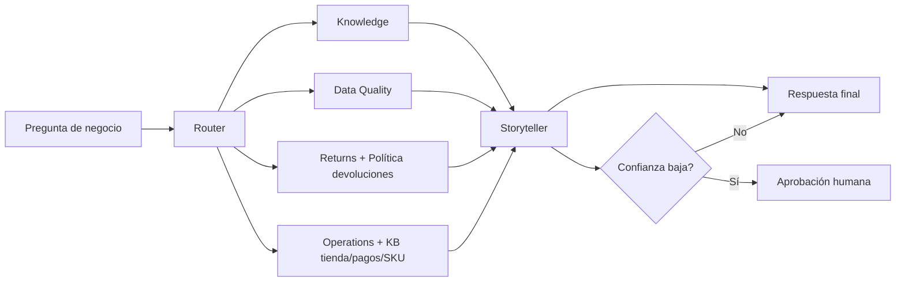

# Paso a paso: creación de agentes y workflows en Microsoft Foundry Portal

Este documento guía la creación de la demo FraSoHome usando únicamente el diseñador de agentes y workflows del portal de Microsoft Foundry. Complementa el plan de sesión `case/plan_sesion_practica_foundry_frasohome.md` y el playbook `agents.md`.

## 1. Resultado esperado

Al terminar, deben existir estos elementos en el proyecto de Microsoft Foundry:

- `frasohome-knowledge`: prompt agent con File Search para responder sobre el caso.
- `frasohome-data-quality`: prompt agent con Code Interpreter para analizar CSVs.
- `frasohome-returns`: agente especialista en devoluciones apoyado en la política vigente.
- `frasohome-operations`: agente especialista en stock, pedidos, tienda, pagos, conciliación y catálogo.
- `frasohome-storyteller`: agente de síntesis ejecutiva.
- `frasohome-orchestrator`: workflow agent visual que enruta una pregunta a especialistas y devuelve una recomendación.

La demo debe poder responder estos tres prompts:

```text
Un cliente compró un sofá online, quiere devolverlo en tienda y usó un cupón. ¿Qué pasos debe seguir atención al cliente?
```

```text
Analiza los CSV de FraSoHome. Genera un Data Quality Report con tabla resumen y cinco acciones de limpieza priorizadas antes de crear features o dashboards.
```

```text
¿Por qué están subiendo las devoluciones online en iluminación y qué haríamos esta semana?
```

## 2. Prerrequisitos

Antes de entrar en el diseñador, valida:

- Tienes una suscripción Azure con acceso al proyecto de Microsoft Foundry.
- El proyecto tiene al menos un modelo desplegado.
- Tu usuario tiene permisos para crear agentes, cargar archivos, usar herramientas y abrir Playground.
- Si vas a mostrar trazas o monitorización, el proyecto tiene Application Insights conectado y permisos RBAC para verlo.
- Los archivos locales están preparados:
  - `case/fraso_home_caso.md`
  - `case/fraso_home_storytelling_foundry.md`
  - `case/kb/README.md`
  - `case/kb/FS-KB-*.md`
  - `case/data/*.csv`

## 3. Abrir el proyecto en Foundry

1. Abre [Microsoft Foundry](https://ai.azure.com).
2. Activa la experiencia nueva de Foundry si el portal muestra un selector de experiencia.
3. Selecciona el proyecto donde se hará la demo.
4. En el área de construcción, abre la sección de agentes.
5. Verifica que puedes crear un agente nuevo y acceder al Playground.

Nota: Microsoft Foundry Agent Service distingue entre prompt agents, workflow agents y hosted agents. Para esta sesión se usan prompt agents y workflow agents porque permiten enseñar el proceso visualmente sin empezar por código.

## 4. Crear el agente `frasohome-knowledge`

### 4.1 Crear el agente

1. En la sección de agentes, selecciona **Create agent**.
2. Nombre: `frasohome-knowledge`.
3. Tipo: prompt agent.
4. Modelo: selecciona el modelo desplegado para la sesión.
5. Guarda o crea la primera versión del agente.

### 4.2 Configurar instrucciones

Pega estas instrucciones:

```text
Eres el agente Knowledge de FraSoHome.

Tu función es responder preguntas operativas sobre el caso FraSoHome usando solo los documentos conectados al agente. FraSoHome es un retailer omnicanal de hogar y decoración con CRM, POS, e-commerce, ERP, devoluciones, stock y problemas de calidad de datos.

Prioridad documental:
1. Políticas y guías vigentes de `case/kb/FS-KB-*.md`.
2. FAQ interna de operaciones y atención.
3. Documento narrativo del caso.
4. Storytelling de la presentación.

Reglas:
- No inventes políticas, excepciones ni métricas.
- Si falta una política formal o hay conflicto entre documentos, dilo de forma explícita.
- Responde con pasos operativos breves.
- Incluye evidencia documental o la parte del caso en la que te basas.
- Incluye incertidumbres y siguiente acción.

Formato de respuesta:
1. Respuesta
2. Evidencia
3. Incertidumbres
4. Siguiente acción
```

### 4.3 Añadir File Search

1. En el panel de herramientas del agente, selecciona **Add tool**.
2. Elige **File Search**.
3. Crea o selecciona un repositorio/vector store para documentos de FraSoHome.
4. Sube:
   - `case/fraso_home_caso.md`
   - `case/fraso_home_storytelling_foundry.md`
   - `case/kb/README.md`
   - `case/kb/FS-KB-01_Politica_Devoluciones_v1.3_Vigente.md`
   - `case/kb/FS-KB-03_Diccionario_KPI_Reglas_Calculo_v1.0.md`
   - `case/kb/FS-KB-04_Manual_Tienda_Caja_y_Pagos_Mixtos_v2.1.md`
   - `case/kb/FS-KB-05_Guia_Conciliacion_Pagos_Ecommerce_v1.4.md`
   - `case/kb/FS-KB-06_Taxonomia_Catalogo_y_Reglas_SKU_v1.2.md`
   - `case/kb/FS-KB-07_Guia_Fidelizacion_CRM_v1.1.md`
   - `case/kb/FS-KB-09_FAQ_Operaciones_y_Atencion_v1.0.md`
5. Espera a que los archivos queden procesados.
6. Guarda una nueva versión del agente.

### 4.4 Probar en Playground

Ejecuta:

```text
Un cliente compró un sofá online, quiere devolverlo en tienda y usó un cupón. ¿Qué pasos debe seguir atención al cliente?
```

Aceptación:

- La respuesta no inventa una política concreta de cupones.
- Usa la política de devoluciones, el manual de caja/pagos mixtos o la FAQ cuando corresponda.
- Propone pasos razonables y una validación humana cuando el caso supere la política.
- Muestra evidencia o referencia a la KB.

## 5. Crear el agente `frasohome-data-quality`

### 5.1 Crear el agente

1. Selecciona **Create agent**.
2. Nombre: `frasohome-data-quality`.
3. Tipo: prompt agent.
4. Modelo: selecciona el modelo desplegado para la sesión.
5. Guarda la primera versión.

### 5.2 Configurar instrucciones

Pega:

```text
Eres el agente Data Quality de FraSoHome.

Tu función es analizar los CSV adjuntos usando Python en Code Interpreter. Debes calcular métricas reales y producir un informe de calidad de datos. Usa la KB como referencia para interpretar KPIs, devoluciones, SKUs, fidelización y pagos.

Reglas:
- Usa Python para leer y perfilar los CSV.
- No inventes cifras.
- Si no puedes calcular algo, dilo.
- Diferencia hallazgos, impacto y acción recomendada.
- Prioriza problemas que bloqueen integración, fact table, features de cliente/producto o dashboards.
- Usa `FS-KB-03` para reglas KPI, `FS-KB-06` para categorías/SKUs y `FS-KB-01` para interpretar devoluciones.

Informe esperado:
- tabla por archivo con filas, columnas, nulos totales y duplicados
- campos críticos con nulos
- claves sin correspondencia si pueden verificarse
- fechas fuera de rango
- importes, cantidades o stock anómalos
- cinco acciones de limpieza priorizadas
```

### 5.3 Añadir Code Interpreter

1. En herramientas, selecciona **Add tool**.
2. Elige **Code Interpreter**.
3. Adjunta los CSV de `case/data`:
   - `crm.csv`
   - `pedidos.csv`
   - `lineas_pedido.csv`
   - `devoluciones_online.csv`
   - `devoluciones_tienda.csv`
   - `ventas_pos.csv`
   - `pagos_tienda.csv`
   - `productos.csv`
   - `stock_diario.csv`
   - `tiendas.csv`
   - `fact_transacciones.csv`
4. Guarda una nueva versión.

Nota de coste: Code Interpreter puede generar cargos adicionales y sesiones por conversación. Para la demo, reutiliza la misma conversación cuando sea posible.

### 5.4 Probar en Playground

Ejecuta:

```text
Analiza los CSV de FraSoHome. Genera un Data Quality Report con: filas y columnas por archivo, nulos críticos, duplicados, claves sin correspondencia, fechas fuera de rango, importes/cantidades anómalas y cinco acciones de limpieza priorizadas. Devuelve tabla resumen y recomendaciones.
```

Aceptación:

- El agente ejecuta Python.
- Aparecen métricas por archivo.
- Se reportan duplicados reales en archivos como `ventas_pos.csv`, `stock_diario.csv`, `lineas_pedido.csv`, `pedidos.csv` o `crm.csv`.
- Las recomendaciones se apoyan en cálculos, no en texto genérico.

## 6. Crear especialistas del workflow

Estos agentes pueden ser más ligeros. Su objetivo es hacer visible el patrón multiagente en el Workflow Designer. Todos deben recibir contexto de la KB a través de `frasohome-knowledge` o tener File Search si quieres que consulten documentos directamente.

### 6.1 `frasohome-returns`

Crear prompt agent con estas instrucciones:

```text
Eres el agente Returns de FraSoHome.

Analiza preguntas sobre devoluciones online y tienda. Usa la política de devoluciones vigente, la FAQ interna y, cuando aplique, el manual de tienda para pagos mixtos. Cuando haya datos disponibles a través de otro agente o del workflow, interpreta motivos, canales, categorías, tasas e impacto.

Devuelve siempre JSON:
{
  "agent": "returns",
  "hallazgos": [],
  "evidencias": [],
  "riesgos": [],
  "confianza": 0.0
}
```

Herramientas recomendadas:

- File Search con la KB, o recibir la salida del agente Knowledge.
- Opcional: Code Interpreter si quieres que Returns analice directamente CSVs de devoluciones.

### 6.2 `frasohome-operations`

Crear prompt agent con estas instrucciones:

```text
Eres el agente Operations de FraSoHome.

Analiza posibles causas operativas relacionadas con stock, tiendas, pedidos, logística, disponibilidad, pagos, conciliación ecommerce, tienda, taxonomía SKU y canal. Usa el manual de tienda, la guía de conciliación, la taxonomía de catálogo y el diccionario KPI como referencia. Señala hipótesis operativas y qué dato hace falta para validarlas.

Devuelve siempre JSON:
{
  "agent": "operations",
  "hallazgos": [],
  "evidencias": [],
  "riesgos": [],
  "confianza": 0.0
}
```

Herramientas recomendadas:

- File Search con la KB, o recibir la salida del agente Knowledge.
- Opcional: Code Interpreter con `stock_diario.csv`, `pedidos.csv`, `lineas_pedido.csv`, `ventas_pos.csv` y `tiendas.csv`.

### 6.3 `frasohome-storyteller`

Crear prompt agent con estas instrucciones:

```text
Eres el agente Storyteller de FraSoHome.

Tu función es convertir evidencias de agentes especialistas en una recomendación ejecutiva clara. No añadas cifras nuevas. No ocultes incertidumbres.

Devuelve JSON válido:
{
  "pregunta": "",
  "causa_probable": "",
  "evidencias": [
    {
      "fuente": "",
      "calculo": "",
      "valor": ""
    }
  ],
  "riesgos": [],
  "accion_7_dias": "",
  "metrica_seguimiento": "",
  "requiere_validacion_humana": true
}
```

Herramientas recomendadas:

- Ninguna. Debe sintetizar, no recalcular.

## 7. Crear el workflow `frasohome-orchestrator`

### 7.1 Crear workflow agent

1. En Foundry, abre la sección de workflows o agentes.
2. Selecciona crear nuevo workflow.
3. Nombre: `frasohome-orchestrator`.
4. Descripción: `Orquestador multiagente para preguntas de negocio de FraSoHome`.
5. Selecciona el modelo base o configuración por defecto que recomiende el proyecto.

### 7.2 Diseñar el flujo

Construye un flujo con esta estructura:



### 7.3 Nodo de entrada

Configura la entrada como:

```json
{
  "pregunta": "{{user_input}}",
  "contexto": "FraSoHome: retail omnicanal de hogar y decoración",
  "restricciones": [
    "no inventar métricas",
    "usar evidencia documental o cálculo",
    "marcar incertidumbre",
    "proponer acción de 7 días"
  ]
}
```

### 7.4 Nodo Router

Si el diseñador permite instrucciones en el nodo, usa:

```text
Clasifica la pregunta del usuario y decide qué agentes especialistas deben participar.

Para preguntas sobre devoluciones online, iluminación, stock o acciones operativas, activa:
- data_quality
- knowledge
- returns
- operations
- storyteller

Si la pregunta pide política o procedimiento, activa knowledge.

Devuelve:
{
  "intencion": "",
  "agentes": [],
  "motivo": ""
}
```

Para la demo, puedes fijar la ruta manualmente:

- `frasohome-data-quality`
- `frasohome-returns`
- `frasohome-operations`
- `frasohome-storyteller`

### 7.5 Nodo Knowledge

Conectar con `frasohome-knowledge`.

Entrada sugerida:

```text
Pregunta: {{pregunta}}

Aporta solo contexto documental relevante desde la KB. Prioriza política de devoluciones, KPI, tienda/pagos, conciliación ecommerce, taxonomía SKU, fidelización y FAQ según la pregunta. Si no hay política concreta, dilo.
```

Salida esperada:

```json
{
  "agent": "knowledge",
  "hallazgos": [],
  "evidencias": [],
  "riesgos": [],
  "confianza": 0.0
}
```

### 7.6 Nodo Data Quality

Conectar con `frasohome-data-quality`.

Entrada sugerida:

```text
Pregunta: {{pregunta}}

Comprueba si los datos disponibles permiten responder. Calcula o resume evidencias relevantes sobre ventas, devoluciones, categoría iluminación, canal online, nulos, duplicados y fiabilidad.

Devuelve JSON con hallazgos, evidencias, riesgos y confianza.
```

Si el agente no conserva archivos entre ejecuciones, vuelve a adjuntar los CSV en la configuración de la herramienta o usa una conversación preparada para demo.

### 7.7 Nodo Returns

Conectar con `frasohome-returns`.

Entrada sugerida:

```text
Pregunta: {{pregunta}}
Contexto normativo de Knowledge: {{knowledge.output}}
Evidencia de calidad de datos: {{data_quality.output}}

Analiza la hipótesis de devoluciones online en iluminación. No inventes cifras. Usa la política de devoluciones y evidencias recibidas, o declara qué falta.
```

### 7.8 Nodo Operations

Conectar con `frasohome-operations`.

Entrada sugerida:

```text
Pregunta: {{pregunta}}
Contexto normativo de Knowledge: {{knowledge.output}}
Evidencia de calidad de datos: {{data_quality.output}}
Evidencia de devoluciones: {{returns.output}}

Evalúa causas operativas posibles: stock irregular, logística, disponibilidad, tienda, pedidos, canal, pagos, conciliación, taxonomía SKU y experiencia de devolución.
```

### 7.9 Nodo Storyteller

Conectar con `frasohome-storyteller`.

Entrada sugerida:

```text
Pregunta original: {{pregunta}}

Evidencias:
- Knowledge: {{knowledge.output}}
- Data Quality: {{data_quality.output}}
- Returns: {{returns.output}}
- Operations: {{operations.output}}

Genera una respuesta ejecutiva en JSON válido con causa probable, evidencias, riesgos, acción de 7 días, métrica de seguimiento y si requiere validación humana.
```

### 7.10 Nodo de condición

Crear condición:

```text
Si storyteller.output.requiere_validacion_humana == true
```

Rama Sí:

- Mostrar mensaje: `La recomendación requiere validación humana antes de ejecutarse`.
- Incluir qué dato falta o qué decisión debe aprobar negocio.

Rama No:

- Entregar respuesta final.

Si el diseñador no permite evaluar directamente el JSON, usa un campo textual de confianza o una variable booleana generada por Storyteller.

## 8. Probar el workflow en Playground

Ejecuta:

```text
¿Por qué están subiendo las devoluciones online en iluminación y qué haríamos esta semana?
```

Revisa:

- El router activa los especialistas correctos.
- Data Quality ejecuta o aporta evidencia calculada.
- Returns no inventa cifras.
- Operations separa hipótesis de dato comprobado.
- Storyteller devuelve JSON final.
- La condición de validación humana funciona.

## 9. Versionar y preparar la demo

1. Guarda una versión estable de cada agente.
2. Añade una descripción breve a cada versión:
   - `demo-knowledge-file-search`
   - `demo-data-quality-code-interpreter`
   - `demo-workflow-orchestrator`
3. Ejecuta los tres prompts canónicos y conserva las conversaciones.
4. Abre Traces o historial de ejecución para tenerlo preparado durante la sesión.
5. Revisa Monitor si hay métricas disponibles.

## 10. Guion de demostración en vivo

### Minuto 0-5: contexto

Explica el problema:

```text
FraSoHome tiene datos suficientes, pero no una verdad operativa común.
```

Muestra los documentos y CSVs.

### Minuto 5-20: Knowledge

1. Abre `frasohome-knowledge`.
2. Enseña instrucciones y File Search.
3. Ejecuta el prompt del sofá online.
4. Señala evidencia e incertidumbre.

Mensaje:

```text
El agente no sustituye la política; la hace accesible, trazable y accionable.
```

### Minuto 20-40: Data Quality

1. Abre `frasohome-data-quality`.
2. Enseña Code Interpreter y archivos adjuntos.
3. Ejecuta el prompt de calidad.
4. Muestra tabla de hallazgos.

Mensaje:

```text
Antes de hacer features o dashboards, necesitamos saber qué datos son fiables.
```

### Minuto 40-60: Workflow

1. Abre `frasohome-orchestrator`.
2. Muestra el diagrama del workflow.
3. Ejecuta la pregunta sobre devoluciones online en iluminación.
4. Enseña el paso por especialistas.
5. Muestra respuesta final y validación humana.

Mensaje:

```text
Foundry permite enseñar el proceso: qué decide el agente, qué calcula una herramienta y dónde interviene una persona.
```

## 11. Checklist final

- [ ] Proyecto abierto en Microsoft Foundry.
- [ ] Modelo desplegado seleccionado.
- [ ] `frasohome-knowledge` creado.
- [ ] File Search configurado con los Markdown del caso y toda la KB de `case/kb/FS-KB-*.md`.
- [ ] `frasohome-data-quality` creado.
- [ ] Code Interpreter configurado con los CSV.
- [ ] Especialistas `returns`, `operations` y `storyteller` creados.
- [ ] Workflow `frasohome-orchestrator` creado.
- [ ] Prompts canónicos probados.
- [ ] Conversaciones o trazas preparadas para mostrar.
- [ ] Respuestas revisadas para evitar métricas inventadas.
- [ ] Respuestas normativas revisadas contra la KB.
- [ ] Validación humana visible en el workflow.

## 12. Referencias oficiales

- Microsoft Foundry Agent Service: https://learn.microsoft.com/azure/foundry/agents/overview
- Agent development lifecycle: https://learn.microsoft.com/en-us/azure/ai-foundry/agents/concepts/development-lifecycle?view=foundry
- Code Interpreter tool: https://learn.microsoft.com/en-us/azure/foundry/agents/how-to/tools/code-interpreter?view=foundry
- Tools overview: https://learn.microsoft.com/en-us/azure/ai-foundry/agents/how-to/tools/overview
- Workflow agents overview: https://learn.microsoft.com/es-es/azure/ai-foundry/agents/concepts/workflow?view=foundry
- Observability: https://learn.microsoft.com/en-us/azure/foundry/concepts/observability

