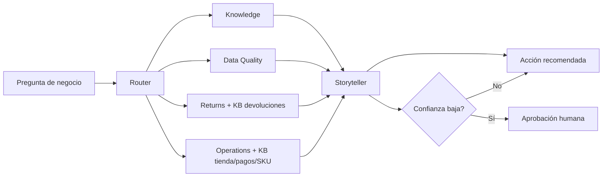

# Plan de sesión práctica: FraSoHome en Microsoft Foundry

## Objetivo

Construir una demo técnica guiada que enseñe el mismo caso por dos caminos complementarios:

- **Interfaz gráfica de Microsoft Foundry:** creación de agentes, subida de documentos/datos, pruebas en playground, herramientas, workflow y observabilidad.
- **SDK en Python:** creación de agentes, File Search, Code Interpreter y una orquestación multiagente mínima reproducible en código.

La sesión debe terminar con tres artefactos demostrables: agente de conocimiento, agente de calidad de datos y flujo multiagente con respuesta ejecutiva.

## Fuentes del caso

- Documento base: `case/fraso_home_caso.md`.
- Storytelling de presentación: `case/fraso_home_storytelling_foundry.md`.
- Base de conocimiento: `case/kb/README.md` y `case/kb/markdown/*.md`.
- Datos: `case/data/*.csv`.
- Señales iniciales reales de calidad: `ventas_pos.csv` tiene 30 duplicados, `stock_diario.csv` tiene 14 duplicados, `lineas_pedido.csv` tiene 8 duplicados, `pedidos.csv` tiene 2 duplicados y `crm.csv` tiene 1 duplicado. Hay nulos repartidos en todas las fuentes, especialmente en `fact_transacciones.csv`, `ventas_pos.csv`, `stock_diario.csv`, `pagos_tienda.csv` y devoluciones.

La KB aporta políticas y guías vigentes: devoluciones omnicanal, KPIs, caja y pagos mixtos, conciliación ecommerce, taxonomía SKU, fidelización CRM y FAQ de operaciones. En la demo, la narrativa del caso explica el contexto; la KB gobierna las respuestas normativas y operativas.

## Prerrequisitos técnicos

- Proyecto de Microsoft Foundry con un modelo desplegado.
- Permisos de proyecto para crear/editar agentes y usar el playground.
- Python 3.10+.
- Autenticación Azure con `az login`.
- Paquete SDK actual: `pip install "azure-ai-projects>=2.0.0" azure-identity python-dotenv`.
- Para Agent Framework: `pip install agent-framework-azure-ai --pre`.

Microsoft indica que el SDK actual para proyectos Foundry usa `azure-ai-projects>=2.0.0` y autenticación con Azure CLI; el código 2.x no es compatible con las APIs clásicas 1.x. También documenta File Search para grounding de documentos, Code Interpreter para ejecutar Python sobre CSVs y el modelo de agentes/conversaciones/respuestas para interacciones con estado.

## Duración recomendada

120 minutos si se quiere que los asistentes vean portal y código con calma. Versión comprimida de 60 minutos: mantener Escena 1 y Escena 2 en vivo, y enseñar Escena 3 como código ya preparado.

## Agenda

| Bloque | Tiempo | Interfaz gráfica | SDK / código | Resultado |
|---|---:|---|---|---|
| 1. Preparación | 10 min | Abrir proyecto, comprobar modelo, revisar Agents | Variables de entorno y dependencias | Entorno listo |
| 2. Demo Knowledge | 25 min | Crear agente, cargar documento Markdown, activar File Search | Crear agente con File Search | Respuesta grounded con evidencia |
| 3. Demo Data Quality | 30 min | Crear agente con Code Interpreter y adjuntar CSVs | Upload de CSVs y prompt de perfilado | Data Quality Report |
| 4. Workflow visual | 20 min | Diseñar router → especialistas → síntesis | Definir contrato JSON | Flujo entendible para negocio |
| 5. Multiagente SDK | 25 min | Mostrar trazas y ejecución | Orquestador Python con agentes especialistas | Recomendación de 7 días |
| 6. Cierre | 10 min | Coste, seguridad, evaluación | Próximos pasos repo/CI | Ruta de hackathon |

## Demo 1: Agente de conocimiento

### En Foundry Portal

1. Crear un agente llamado `frasohome-knowledge`.
2. Instrucciones: responder como asistente de operaciones de FraSoHome, citar evidencia documental, reconocer incertidumbre y proponer siguiente paso operativo.
3. Subir `case/fraso_home_caso.md`, `case/fraso_home_storytelling_foundry.md`, `case/kb/README.md` y todos los Markdown de `case/kb/markdown`.
4. Activar File Search.
5. Probar en Playground:

```text
Un cliente compró un sofá online, quiere devolverlo en tienda y usó un cupón. ¿Qué pasos debe seguir atención al cliente?
```

### En SDK

```python
import os
from azure.identity import DefaultAzureCredential
from azure.ai.projects import AIProjectClient
from azure.ai.projects.models import FileSearchTool, PromptAgentDefinition

project = AIProjectClient(
    endpoint=os.environ["PROJECT_ENDPOINT"],
    credential=DefaultAzureCredential(),
)

# Preparar File Search: subir archivo, crear vector store y asociarlo al agente.
# La forma exacta puede variar entre setup básico/estándar, pero el patrón es:
# 1. upload file
# 2. create vector store
# 3. create agent with FileSearchTool(vector_store_ids=[...])

agent = project.agents.create_version(
    agent_name="frasohome-knowledge",
    definition=PromptAgentDefinition(
        model=os.environ["MODEL_DEPLOYMENT"],
        instructions=(
            "Eres el agente Knowledge de FraSoHome. Prioriza la KB vigente para políticas, "
            "usa el caso para contexto y responde con evidencia documental, incertidumbres "
            "y siguiente acción."
        ),
        tools=[FileSearchTool(vector_store_ids=[os.environ["VECTOR_STORE_ID"]])],
    ),
)
```

## Demo 2: Calidad de datos con Code Interpreter

### En Foundry Portal

1. Crear `frasohome-data-quality`.
2. Activar Code Interpreter.
3. Adjuntar los CSV de `case/data`.
4. Usar la KB como referencia de reglas de cálculo y validaciones, especialmente `FS-KB-03_Diccionario_KPI_Reglas_Calculo_v1.0.md`, `FS-KB-06_Taxonomia_Catalogo_y_Reglas_SKU_v1.2.md` y `FS-KB-01_Politica_Devoluciones_v1.3_Vigente.md`.
5. Lanzar prompt:

```text
Analiza los CSV de FraSoHome. Genera un Data Quality Report con: filas y columnas por archivo, nulos críticos, duplicados, claves sin correspondencia, fechas fuera de rango, importes/cantidades anómalas y cinco acciones de limpieza priorizadas. Usa el diccionario de KPI, la taxonomía SKU y la política de devoluciones de la KB como referencia de reglas. Devuelve tabla resumen y recomendaciones.
```

### En SDK

```python
import os
from pathlib import Path
from azure.identity import DefaultAzureCredential
from azure.ai.projects import AIProjectClient
from azure.ai.projects.models import PromptAgentDefinition, CodeInterpreterTool

project = AIProjectClient(
    endpoint=os.environ["PROJECT_ENDPOINT"],
    credential=DefaultAzureCredential(),
)

file_ids = []
for csv_path in Path("case/data").glob("*.csv"):
    uploaded = project.files.upload(file_path=str(csv_path), purpose="assistants")
    file_ids.append(uploaded.id)

agent = project.agents.create_version(
    agent_name="frasohome-data-quality",
    definition=PromptAgentDefinition(
        model=os.environ["MODEL_DEPLOYMENT"],
        instructions=(
            "Eres el agente Data Quality de FraSoHome. Usa Python para perfilar CSVs, "
            "calcula evidencias y devuelve un informe estructurado. Usa la KB para interpretar "
            "KPIs, SKUs y devoluciones. No inventes métricas."
        ),
        tools=[CodeInterpreterTool(file_ids=file_ids)],
    ),
)
```

## Demo 3: Flujo multiagente

### En Foundry Portal

Crear un workflow visible para negocio:



Prompt de prueba:

```text
¿Por qué están subiendo las devoluciones online en iluminación y qué haríamos esta semana?
```

### Contrato de salida

```json
{
  "pregunta": "...",
  "causa_probable": "...",
  "evidencias": [
    {"fuente": "...", "calculo": "...", "valor": "..."}
  ],
  "riesgos": ["..."],
  "accion_7_dias": "...",
  "metrica_seguimiento": "...",
  "requiere_validacion_humana": true
}
```

### Orquestador SDK mínimo

```python
import json
from dataclasses import dataclass

@dataclass
class SpecialistResult:
    agent: str
    findings: list[dict]
    risks: list[str]
    confidence: float

async def ask_agent(agent, question: str) -> SpecialistResult:
    response = await agent.run(question)
    payload = json.loads(response.text)
    return SpecialistResult(
        agent=payload["agent"],
        findings=payload.get("hallazgos", []),
        risks=payload.get("riesgos", []),
        confidence=payload.get("confianza", 0.0),
    )

async def orchestrate(question: str, agents: dict):
    selected = ["data_quality", "returns", "operations", "storyteller"]
    evidence = []
    risks = []
    confidence = 1.0

    for name in selected[:-1]:
        result = await ask_agent(agents[name], question)
        evidence.extend(result.findings)
        risks.extend(result.risks)
        confidence = min(confidence, result.confidence)

    synthesis_prompt = json.dumps({
        "question": question,
        "evidence": evidence,
        "risks": risks,
        "required_output": "causa probable, evidencia, impacto, acción de 7 días y métrica de seguimiento",
    }, ensure_ascii=False)

    final = await agents["storyteller"].run(synthesis_prompt)
    return {
        "answer": final.text,
        "requires_human_validation": confidence < 0.75,
    }
```

## Guion de facilitación

1. **Abrir con el problema:** “Tenemos datos suficientes y políticas internas, pero no una verdad operativa común”.
2. **Mostrar Knowledge:** la política no vive en la memoria del modelo, vive en documentos trazables de la KB.
3. **Mostrar Data Quality:** el agente ejecuta cálculo y deja evidencias, no solo redacta una opinión.
4. **Mostrar Workflow:** el público ve qué especialista actúa y dónde entra validación humana.
5. **Mostrar SDK:** lo visual sirve para diseñar y explicar; el código sirve para versionar, testear e industrializar.
6. **Cerrar con gobernanza:** identidad, RBAC, trazas, evaluación, coste y permiso humano en decisiones sensibles.

## Criterios de aceptación de la demo

- La respuesta final cita fuente o cálculo.
- Las respuestas operativas usan la KB de `case/kb/markdown` como fuente normativa.
- Las métricas salen de los CSV, no de texto inventado.
- El contrato JSON se valida antes de sintetizar.
- Si falta información, el agente lo declara.
- La acción recomendada tiene responsable, plazo y métrica.
- Se enseña al menos una traza o historial de ejecución en Foundry.

## Fuentes oficiales consultadas

- Microsoft Foundry Quickstart: https://learn.microsoft.com/en-us/azure/foundry/quickstarts/get-started-code?view=azure-ai-foundry-latest
- Code Interpreter para Foundry agents: https://learn.microsoft.com/en-us/azure/foundry/agents/how-to/tools/code-interpreter?view=foundry
- File Search para Foundry agents: https://learn.microsoft.com/en-us/azure/foundry/agents/how-to/tools/file-search?view=foundry-classic
- Runtime components de Foundry Agent Service: https://learn.microsoft.com/en-us/azure/foundry/agents/concepts/runtime-components
- Microsoft Agent Framework con Foundry: https://learn.microsoft.com/es-es/agent-framework/agents/providers/microsoft-foundry
